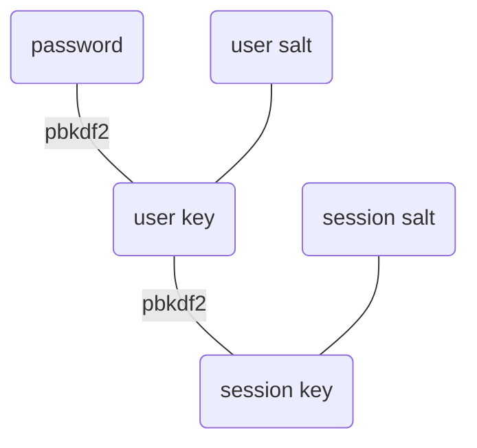

# Introduction

# Key derivation 

```mermaid
graph
    id1(password)
    id2(user salt)
    id3(user key)
    id4(session salt)
    id5(session key)
    id1 -- pbkdf2 --- id3
    id2 --- id3
    id3 -- pbkdf2 --- id5
    id4 --- id5
  
```
